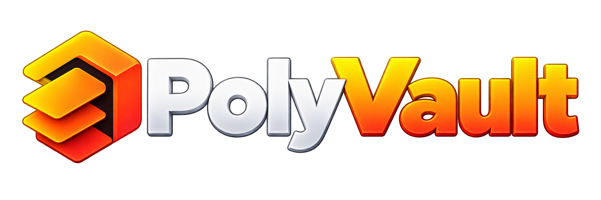
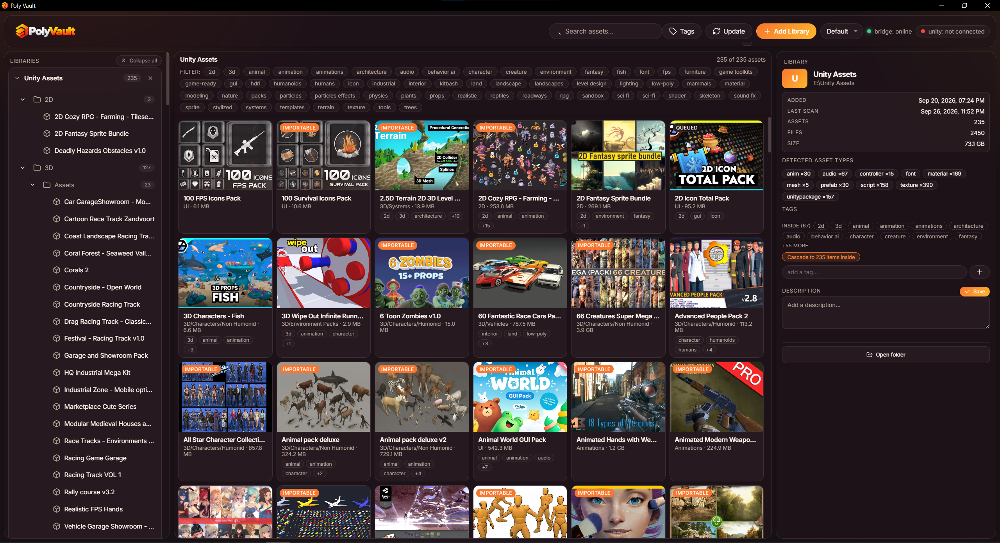

<p align="center">
  
</p>

# Poly Vault

**Every 3D & 2D asset you own, in one searchable library — with one-click import into Unity 6.**

<p align="center">
  <a href="https://github.com/xeeshanqaswar/Poly-Vault"></a>
  <a href="https://github.com/xeeshanqaswar/Poly-Vault/releases"></a>
  <a href="LICENSE"></a>
  
  <a href="https://github.com/xeeshanqaswar/Poly-Vault/actions"></a>
  
  <a href="https://github.com/xeeshanqaswar/Poly-Vault/issues"></a>
</p>

<p align="center">
  
</p>

If you have ever lost track of that prop pack you downloaded eight months ago,
this is for you. Point Poly Vault at your asset folders and it turns them into
a tidy, searchable library — thumbnails, tags and notes — then drops any asset
into your Unity project without you going back to Explorer.

**No cloud. No account. No tracking.** Your library is never uploaded, and your
original files are never modified.

<p align="center">
  <a href="https://github.com/xeeshanqaswar/Poly-Vault/releases"><b>Download Poly Vault</b></a>
  &nbsp;·&nbsp;
  <a href="#what-it-does">See what it does</a>
  &nbsp;·&nbsp;
  <a href="#get-it">Windows · Linux · macOS</a>
</p>

---

## What it does

- **Sees everything you already own.** Point it at any folder on your computer.
  Every model, texture, sound, video, font and script inside becomes a card with
  a thumbnail, sorted into a folder tree you can click through.
- **Finds things in seconds.** Search by name, description or tag. Combine tags
  to narrow thousands of files down to just the props you need for one scene.
- **Labels things once.** Add a tag or a note to a single asset, a whole folder,
  or your entire library. Tag a folder once and everything inside it inherits
  that tag.
- **Fills in the blanks for you.** Drop in a new asset pack and Poly Vault looks
  it up in the Unity Asset Store, writes a real description, and suggests tags —
  so a fresh download is never a blank card.
- **Sends assets to Unity in one click.** With the bundled Unity 6 add-on, an
  import is a single click and the files land in your project, tags attached.
  Your library is only ever read, never moved or modified.
- **Tells you when Unity is ready.** A small indicator shows when the Editor
  add-on is connected, and each import shows its progress as it happens.
- **Looks like it belongs on your desktop.** Light, dark and default themes,
  resizable panels, and no menu-bar clutter.

## Who it's for

- Unity artists and game developers with a growing folder of downloaded assets
- Anyone who wants their models, textures and audio organised and searchable
- Teams who need to know exactly where an asset came from and what it contains
- People who don't want their asset library sitting in someone else's cloud

## Get it

| Platform | Download | Install |
| --- | --- | --- |
| **Windows** | `PolyVault-Setup-0.4.0.exe` | Run the installer. |
| **Linux** | `PolyVault-0.4.0-x86_64.AppImage` or `PolyVault-0.4.0-amd64.deb` | `chmod +x` and run it, or `sudo dpkg -i`. |
| **macOS** | `PolyVault-0.4.0-arm64.dmg` (or `x64.dmg`) | Open the DMG and drag the app to Applications. |

Grab them from the [releases page](https://github.com/xeeshanqaswar/Poly-Vault/releases).
macOS DMGs are produced by our build servers; Linux and Windows builds are
attached directly to each release.

> **First run?** Windows may show a SmartScreen warning because the installer is
> unsigned — choose **More info → Run anyway**. On macOS, right-click the app and
> choose **Open** the first time. Nothing is broken; the app is simply not
> signed with a paid certificate.

**In three steps:** install the app → click **Add Library** and pick your asset
folder → browse, tag and search. That is the whole setup. Unity import is
optional and takes about a minute.

## Getting assets into Unity

1. **Add the Poly Vault add-on to your project** — download it from the
   [releases page](https://github.com/xeeshanqaswar/Poly-Vault/releases):
   `PolyVault-Unity-0.4.0.zip` (or `.tgz`). In Unity, open **Window → Package
   Manager → + → Add package from disk** and pick the `package.json` inside.
2. Open **Window → Poly Vault** in Unity — that's it, nothing else to configure.
3. From the desktop app, press **Import to Unity** on any asset. It is copied
   into `Assets/PolyVaultImports/…` with its tags, and Unity shows the progress
   as it lands.

`.unitypackage` files open Unity's own import dialog so you stay in control;
everything else is copied automatically. Your original files are never moved,
renamed or deleted.

## Your data stays yours

- Everything is stored in **plain JSON files** in your app data folder
  (`%APPDATA%\Poly Vault`, `~/.config/Poly Vault`, or
  `~/Library/Application Support/Poly Vault`). Back it up by copying a folder.
- **No telemetry, no accounts, no cloud sync.** The app talks to nothing except
  your own machine.
- The single exception is a description lookup in the Unity Asset Store for each
  new asset, sent from your machine to the store's public page. Nothing else is
  ever requested.
- The local helper the app uses binds to `127.0.0.1` only — it is not reachable
  from your network.

## What's new

- **0.4** — new assets now describe and tag themselves from the Unity Asset
  Store automatically, **Update** re-checks exactly what you have selected
  (asset → folder → library → everything), and the interface got a full visual
  refresh.
- **0.3** — renamed from *Asset Vault* to *Poly Vault*. Existing libraries,
  tags and descriptions carried over automatically.

---

<details>
<summary><b>For developers, contributors and power users</b> — architecture, API, folder rules, dev commands</summary>

## How it works

1. **Add a library** — pick any folder containing *category subfolders*.
2. The app scans it (filesystem only; nothing leaves your machine) and shows it
   as a **tree on the left** and **preview cards in the middle**.
3. Click any **folder or card** → the **details panel on the right** shows
   dates, counts, sizes, detected asset types, tags, and a description editor.
4. Anything importable gets an **Import to Unity** button. If the Unity Editor
   plugin is running, the asset lands in
   `Assets/PolyVaultImports/<Library>/<Category>/<Asset>/…`, always as a
   **copy** — your library is never modified.
5. New assets are looked up in the Unity Asset Store in the background, so their
   description and derived tags fill in on their own. **Update** re-scans and
   re-checks just what you have selected.

Card selection is flicker-free (only the highlight and details update),
rescans skip repainting when nothing changed, and resizing the three-pane
layout is pointer-driven with the widths remembered between runs.

## Folder layout convention

Folders can nest as deep as you like. A folder becomes an **asset** when a
preview image or an importable file sits **directly** inside it; anything else
is a **folder** used for organisation.

```
MyLibrary                    ← the folder you "Add Library"
├── 3d
│   ├── Props
│   │   └── Furniture
│   │       ├── Chair
│   │       │   ├── preview.png      ← card thumbnail
│   │       │   ├── chair.fbx        ← importable → Import buttons
│   │       │   └── readme.txt       ← ignored (not importable)
│   │       └── StoneVase
│   │           └── preview.webp     ← browse-only (nothing importable)
├── 2d
│   └── GrassTile
│       ├── preview.jpg              ← card thumbnail
│       └── grass.png                ← imported as a texture
```

The rules that decide what shows up:

- **Asset** = a folder that directly contains a preview image
  (`preview.png/jpg/jpeg/webp/gif`) **or** an importable file. Folders that
  only contain other folders are **folder** (container) nodes in the tree.
- The **preview image is never imported** — a folder with only a `preview.png`
  is browse-only.
- **Importable extensions** — Unity packages, meshes/models
  (`.fbx .obj .glb .gltf .blend .dae .3ds .dxf .stl …`), textures, fonts,
  audio, video, animation, materials, and scripts. See the
  [specification](docs/SPECIFICATION.md#importable-file-kinds) for the full
  list.
- Drop an empty **`.assetvault-ignore`** (or `.nomedia`) file into any folder
  to skip it (and its whole subtree).

## Unity 6 add-on reference

After installing the package, **Window → Poly Vault → Poly Vault** exposes:

- **Server URL** — `http://127.0.0.1:7100` (must match the desktop app).
- **Sync in background** — polls the app on an interval while Unity is open.
- **Auto-import safe jobs** — imports everything except `.unitypackage`
  (those open Unity's interactive import dialog).
- **Import now** — manual, always-interactive import per job.

Jobs queued from the desktop app are picked up here, marked **processing**,
imported, and reported back — the desktop app's job badge updates within
seconds. Files are **copies**; nothing is ever moved or deleted from your
library. Tags are written alongside each import as `polyvault.tags.json`.

## Power-user controls

The bridge and data folders can be redirected — handy for scripting, backups,
and the test suite:

| Variable | Effect |
| --- | --- |
| `ASSETVAULT_USER_DATA` | Redirect the user-data folder (headless/test isolation) |
| `ASSETVAULT_BOOT_LIBRARY` | Register a library at boot without the folder dialog |
| `ASSETVAULT_NO_ENRICH` | `1` disables all Asset Store lookups (used by the E2E test) |
| `ASSETVAULT_DEBUG` | Stream renderer console messages to stdout |

The bridge port/host can also be changed in `asset-vault-settings.json`
(`server` object); the Unity plugin's Server URL must then match.

## Development

Requirements: [Node.js](https://nodejs.org) 20+ (tested on 24 LTS).

```powershell
npm install
npm run smoke   # headless scanner + bridge test (no Electron window)
npm run e2e     # boots the real app with a fixture library and checks the UI
npm start       # run the app (dev)
npm run icons   # regenerate icons / logo / bundled fonts (only after artwork changes)
```

## Packaging for release

```powershell
npm run pack          # unpacked dev build → dist/win-unpacked
npm run dist          # Windows NSIS installer → dist/PolyVault-Setup-<ver>.exe
npm run dist:linux    # Linux AppImage + .deb → dist/
npm run dist:mac      # macOS DMG + zip → dist/  (requires a Mac)
```

> **One-command cross-platform builds:** the bundled
> [GitHub Actions workflow](.github/workflows/build.yml) builds Windows, Linux,
> and macOS installers on every `v*` tag and uploads them as workflow
> artifacts — push a tag, grab `dist/*` from the Actions tab.

The Windows `exe` is unsigned by default (SmartScreen prompt);
`docs/TECHNICAL.md#packaging--signing` covers code-signing and macOS
notarisation. AppImage/deb and DMG builds must match the host OS (or use the
CI workflow).

## Documentation

| Doc | What it covers |
| --- | --- |
| [docs/SPECIFICATION.md](docs/SPECIFICATION.md) | Product & technical specification: every capability, functional requirements, API contracts, and edge-case behaviour |
| [docs/TECHNICAL.md](docs/TECHNICAL.md) | Developer guide: architecture, internals, storage, security, packaging, test harness |
| [CHANGELOG.md](CHANGELOG.md) | Release history |
| [CONTRIBUTING.md](CONTRIBUTING.md) | How to report bugs and submit changes |

## Contributing

Contributions are welcome — bug reports, fixes, and feature ideas. Please read
[CONTRIBUTING.md](CONTRIBUTING.md) first; the important bits: run the smoke and
e2e tests, keep changes scoped, and match the existing code style.

## Changelog

See [CHANGELOG.md](CHANGELOG.md) for the full release history.

## License

[MIT](LICENSE) © Zeeshan Qaswar. Unity support is provided by the bundled **Poly Vault** Editor package under `unity-plugin/PolyVault`.

</details>

---

<p align="center">
  Built by <a href="https://github.com/xeeshanqaswar">Zeeshan Qaswar</a> · MIT licensed · <a href="https://github.com/xeeshanqaswar/Poly-Vault/issues">Report an issue</a>
</p>